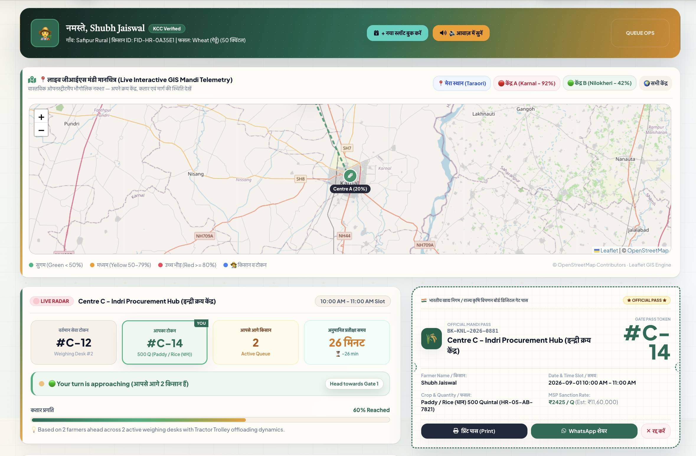
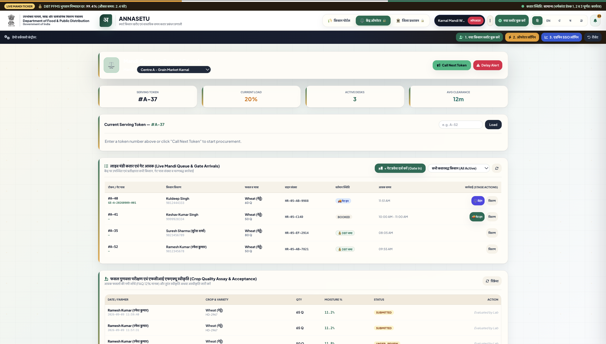
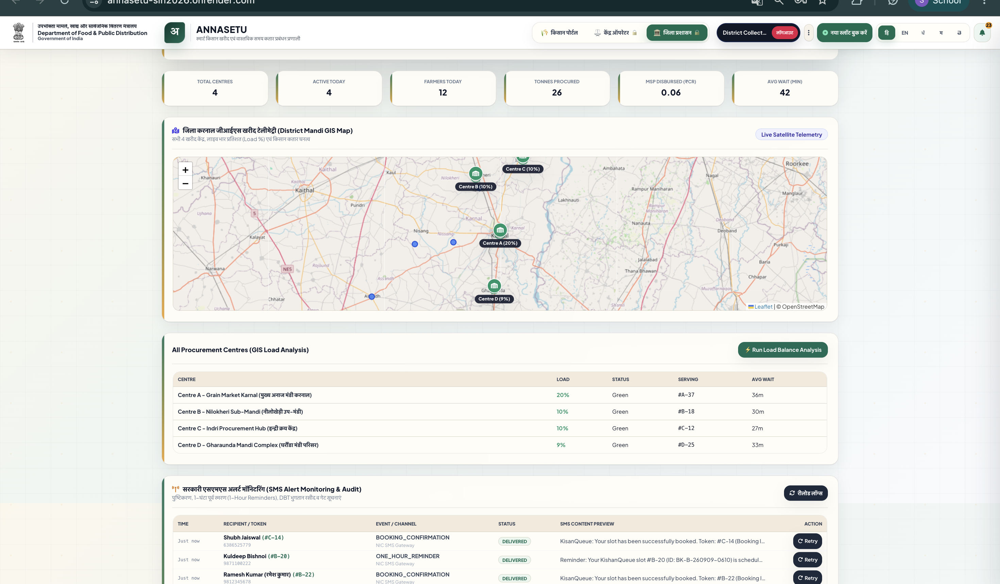
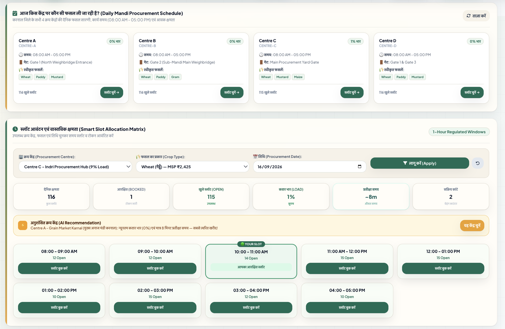
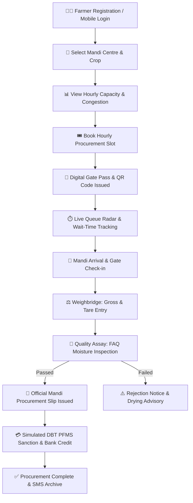
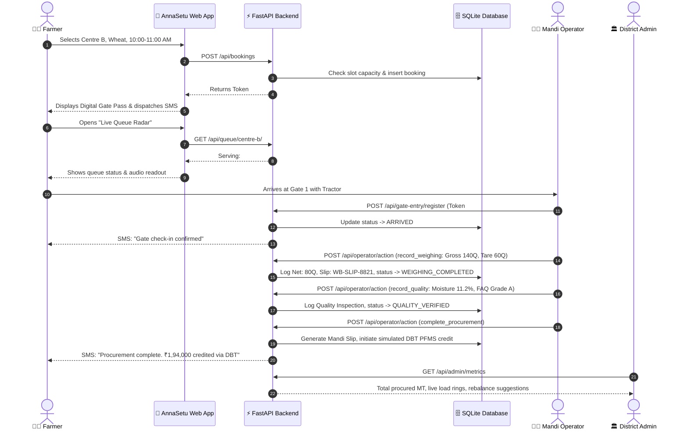
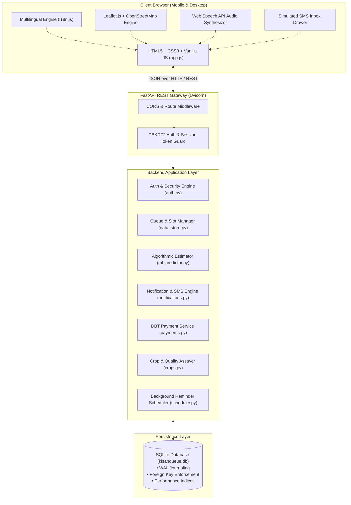

# 🌾 AnnaSetu (अन्नसेतु)

> **Smart Farmer Procurement, Slot Booking & Real-Time Mandi Queue Management**

[](#)
[](https://fastapi.tiangolo.com)
[](https://python.org)
[](https://sqlite.org)
[](https://leafletjs.com)
[](#-11-multilingual-support)
[](#-13-automated-test-suite--quality-assurance)

**AnnaSetu (अन्नसेतु)** is a farmer-centric digital procurement and real-time mandi queue management platform built for the **Smart India Hackathon (SIH 2026)**. It replaces unstructured, chaotic mandi arrivals with regulated hourly slot bookings, live transparent queue radars, algorithmic wait-time forecasting, and a full 7-stage procurement lifecycle tracker. By seamlessly connecting farmers, mandi operators, and district agricultural administrators onto a single lightweight platform, AnnaSetu eliminates physical congestion, restores predictability to harvesting logistics, and bridges information barriers across Indian agricultural markets.

---

## 🌐 Live Demo

👉 **[https://annasetu-sih2026.onrender.com/](https://annasetu-sih2026.onrender.com/)**

> **Notice:** This deployment is an interactive **Live Prototype** developed for demonstration, evaluation, and hackathon presentation purposes. It is hosted on cloud infrastructure and is **not** an official government portal.

---

## 📸 AnnaSetu in Action

These screenshots demonstrate the platform across all three user perspectives—Farmer, Mandi Operator, and District Administration—alongside the core capacity-controlled slot booking workflow.

### 👨🌾 Farmer Experience


Demonstrates the farmer-facing dashboard, live queue status, serving token vs. personal token tracking, estimated wait-time radar, and downloadable digital gate pass with QR code.

### 👨💼 Mandi Operator Experience


Demonstrates the real-time mandi yard terminal, displaying live queue counters, current serving token management, centre load monitoring, gate arrival verification, gross/tare weighbridge calculations, and FAQ quality grading.

### 🏛️ District Administration


Demonstrates the district-wide administrative telemetry, including the interactive GIS map with load radar rings, centre capacity monitoring, aggregate procurement metrics, and algorithmic load-balancing diversion recommendations.

### 📅 Smart Slot Allocation


Demonstrates the hourly procurement slot allocation interface, enabling farmers to select centres, crops, and dates with clear visibility into capacity limits, congestion levels, wait times, and smart centre recommendations.

---

## 🌱 1. The Problem

During peak harvesting seasons, agricultural mandis (APMCs) and government procurement centres across India face severe logistical stress. The absence of structured arrival scheduling and transparent queue mechanisms creates widespread difficulties for farmers and mandi staff alike:

- **Long and Uncertain Waiting:** Farmers frequently wait in line for hours outside mandi gates with loaded tractors and trucks without knowing when their grain will be inspected or weighed.
- **Unpredictable Arrival Timing:** Without prior booking, hundreds of farmers arrive simultaneously during early morning hours (8:00 AM – 10:00 AM), causing severe traffic gridlocks and overwhelmed weighbridges.
- **Lack of Queue Visibility:** Once inside the yard, farmers have no live status tracking. They are forced to repeatedly approach operators to ask when their turn will arrive.
- **Mandi Yard Congestion:** Peak-hour crowding creates safety hazards, vehicle idling fuel waste, and deterioration of grain sacks exposed to open-air weather conditions.
- **Asymmetric Centre Awareness:** A primary grain market in a district often operates at over 90% capacity, while a neighboring sub-mandi just 10–15 km away remains underutilized at 30–40% capacity because farmers lack real-time load visibility.
- **Fragmented Procurement Information:** Weighbridge receipts, quality Fair Average Quality (FAQ) inspection results, mandi procurement slips, and Direct Benefit Transfer (DBT) payment references are historically dispersed across physical slips and disparate offices.
- **Language and Literacy Barriers:** Complex administrative portals often fail grassroot adoption because they are text-heavy, available only in English, and lack audio or regional-language accessibility.

---

## 💡 2. The AnnaSetu Solution

AnnaSetu is an **integrated digital procurement bridge** rather than a mere booking form. It bridges the gap between field harvest, mandi yard operations, and transparent administrative oversight. 

The entire lifecycle—from account registration and hourly slot reservation to gate check-in, weighbridge recording, grain moisture assaying, mandi slip issuance, and simulated Direct Benefit Transfer (DBT)—operates in real time.



---

## ⭐ 3. Why AnnaSetu is Different

AnnaSetu transitions mandi logistics from static, uncoordinated queues into a dynamic, transparent, and balanced procurement ecosystem.

| Conventional Mandi Approach | AnnaSetu Approach |
|---|---|
| **Unannounced physical arrival** leading to yard gridlocks | **Regulated hourly slot bookings** (1-hour time windows) |
| **Zero visibility** into queue progress or waiting times | **Live Queue Radar** showing active token, queue position, and wait estimates |
| **Farmers tethered to yard** for hours to avoid losing their turn | **Remote queue monitoring**; farmers arrive exactly when their turn approaches |
| **Severe load imbalances** between urban and rural centres | **District GIS telemetry** with algorithmic diversion recommendations |
| **Manual paper slips** that are easily lost or damaged | **Digital Gate Pass** with verifiable QR payload, print view, and WhatsApp sharing |
| **Disjointed stages** between gate, weighbridge, and assaying | **Unified 7-Stage Procurement Journey** from booking to bank credit |
| **Missed slots require re-queuing** from scratch | **Missed Slot Recovery Engine** reassigning optimal slots without lost seniority |
| **English-centric or complex desktop portals** | **Multilingual interface in 5 Indian languages** with Web Speech API voice readout |
| **Lack of off-site notifications** | **Simulated SMS alert engine** with automated 1-hour advance reminders |

### The Central Differentiator
The core strength of AnnaSetu is the integration of:
$$\text{Farmer Self-Service} + \text{Slot Capacity Planning} + \text{Live Queue Telemetry} + \text{Yard Operations Terminal} + \text{Multilingual Accessibility} + \text{District GIS Oversight}$$
into **one lightweight, zero-dependency platform** that loads instantly on mobile browsers and runs with minimal server overhead.

---

## 🚀 4. Core Features

### 🚦 Smart Slot Allocation
- Distributes daily procurement volume across regulated 1-hour time windows (08:00 AM to 05:00 PM).
- Enforces strict per-slot capacity limits to prevent morning stampedes and gate bottlenecks.
- Displays real-time congestion indicators (`Smooth`, `Medium`, `High`, `Full`).
- Prevents duplicate bookings for the same farmer on the same date.

### 📍 Live GIS Mandi Map
- Powered by Leaflet.js and OpenStreetMap with zero proprietary map API costs.
- Displays geographic markers for district procurement centres with live status color rings:
  - 🟢 **Green:** Low load (< 50% capacity)
  - 🟡 **Yellow:** Moderate load (50% – 79% capacity)
  - 🔴 **Red:** High load (≥ 80% capacity)
- Interactive popup overlays show active serving token, daily quota, available counters, and driving directions.

### 🎟️ Digital Token & Gate Pass
- Automatically issues a unique sequential token (e.g., `#A-52`) upon booking.
- Generates a QR payload containing farmer name, FID, centre, crop, and quintal volume for instant scanner check-in at the gate.
- Includes a 1-click **Print Gate Pass** stylesheet and a **Share via WhatsApp** shortcut for farmers without printers.

### ⏱️ Queue & Wait-Time Estimation
- Dynamic algorithmic radar displaying:
  - **Currently Serving Token** (e.g., `#A-37`)
  - **Farmer's Token** (e.g., `#A-52`)
  - **Farmers Ahead in Line** (e.g., `15 farmers`)
  - **Estimated Wait-Time Range** (e.g., `47 mins [39 – 55 min]`)
- Accounts for parallel weighbridge counters, vehicle offloading dynamics, diurnal peak curves, and moisture sampling delays.

### 🔄 Missed Slot Recovery
- If a farmer is delayed due to transportation breakdowns or harvest delays, the system allows 1-click slot recovery.
- Re-allocates the farmer to the next available slot with minimal congestion without forfeiting queue seniority or forcing full re-registration.

### ⚖️ Operator Procurement Workflow
- Dedicated terminal for mandi yard operators to manage daily queues:
  - **Gate Entry / Mark Arrived:** Verifies token and logs gate arrival timestamp.
  - **Call Next Token:** Advances the serving counter and dispatches turn alerts.
  - **Broadcast Delay:** Alerts all queued farmers if weighbridge maintenance or weather halts processing.

### 🌾 Weighing / Crop Quality Workflow
- **Weighbridge Module:** Operator logs Gross Weight and Tare Weight; the system calculates Net Quintals and issues an official Weighbridge Slip number (`WB-SLIP-XXXX`).
- **Quality & Moisture Assay:** Evaluates Fair Average Quality (FAQ) parameters (Moisture %, Foreign Matter %, Damaged Grains %).
- Automatic grade assignment (`Grade A (FAQ)`, `Grade B`, or `Rejected`) with moisture deduction calculations and actionable drying advice if rejected.

### 💰 Procurement & DBT Status *(Prototype / Demo Simulation)*
- Generates official Mandi Procurement Slips (`MSP-SLIP-XXXX`) calculating total payout based on Minimum Support Price (MSP).
- **Simulated DBT Dispatch:** Simulates Direct Benefit Transfer (DBT) sanction and Public Financial Management System (PFMS) transaction references (`GOV-AGRI-PFMS-XXXX`) with downloadable payment receipts.
- *Clearly labeled within the application as prototype simulation for demonstration.*

### 🌐 Multilingual Interface
- Client-side internationalization in **5 Indian languages**: Hindi, English, Punjabi, Marathi, and Telugu.
- Instant language switching across all headings, badges, status messages, inputs, and error alerts with localStorage persistence.

### 🔊 Voice Readout
- Integrates the browser's native **Web Speech API** to vocalize queue updates, token status, waiting times, and centre advisories in spoken Hindi or English.
- Designed specifically for elderly or low-literacy farmers who prefer listening over reading small text.

### 📩 SMS / Notification Simulation *(Prototype / Demo Simulation)*
- Features a slide-over **SMS Inbox Drawer** simulating government push notifications (`KISANQ` / `KisanSMS-GovPush`).
- Automatically generates notifications for:
  - Slot confirmation with gate directions
  - 1-hour advance arrival reminders
  - Gate arrival check-in confirmations
  - "Your Turn Active" weighbridge summons
  - FAQ Quality assay certification or rejection
  - DBT MSP credit confirmation
- Implements backend idempotency keys to prevent duplicate dispatches and supports pluggable SMS provider drivers (`fast2sms`, `twilio`, `msg91`).

---

## 👨‍🌾 5. Farmer-First Design

> **"Technology should adapt to the farmer — the farmer should not have to adapt to complex technology."**

AnnaSetu is intentionally built around the real-world mental model of a farmer. Instead of forcing farmers to navigate nested bureaucratic menus, the interface provides immediate, unambiguous answers to seven critical questions:

| Question the Farmer Asks | How AnnaSetu Delivers the Answer |
|---|---|
| **Where do I go?** | Clearly displays centre name, gate number, address, and interactive route guidance tips. |
| **When do I go?** | Confirms a dedicated 1-hour slot (e.g., `10:00 - 11:00 AM`) with an advance SMS reminder. |
| **What is my token?** | Prominently displays high-contrast token badges (e.g., `#A-52`) with a digital QR pass. |
| **How many farmers are ahead of me?** | Live radar displays exact count (e.g., `15 farmers ahead`) updated on each operator action. |
| **How long may I have to wait?** | Algorithmic wait-time estimator provides a realistic window (e.g., `~47 minutes`). |
| **What stage is my procurement at?** | Interactive 7-stage visual tracker highlights current milestone (Booking → Gate → Weighing → FAQ → Mandi Slip → DBT). |
| **What happens next?** | Contextual status banners explain the immediate next step (e.g., *"Proceed to Weighbridge Counter 2"*). |

### Farmer Accessibility Principles
- **Hindi by Default:** Native Hindi terminology used throughout with intuitive cultural resonance (उदा. *धर्मकांटा*, *नमी जांच*, *खरीद पर्ची*).
- **High-Contrast, Touch-Friendly UI:** Large buttons, generous padding, and clear status badges designed for mobile screens in outdoor sunlight.
- **Audio Announcements:** 1-click voice readout reads aloud token status and instructions.
- **Resilient Recovery:** Forgotten passwords can be reset via simple security questions without requiring third-party email access.

---

## 👥 6. Three User Roles

AnnaSetu provides dedicated, role-specific views configured to the responsibilities of each stakeholder:

| Capability | 👨‍🌾 Farmer Portal | 👨‍💼 Mandi Operator Terminal | 🏛️ District Administrator |
|---|:---:|:---:|:---:|
| **Account Registration & Login** | ✅ Mobile / Password | ✅ Secure Operator ID | ✅ Admin SSO / Credential |
| **Hourly Slot Booking** | ✅ Select centre, crop & time | ❌ | ❌ |
| **Live Queue Telemetry & Radar** | ✅ View token, ahead & wait time | ✅ View active yard queue | ✅ District-wide queue overview |
| **Digital Gate Pass & QR Code** | ✅ View, Print & WhatsApp | ✅ Scan & verify at gate | ❌ |
| **Voice Readout (Audio)** | ✅ Web Speech API (Hindi/Eng) | ❌ | ❌ |
| **1-Click Missed Slot Recovery** | ✅ Reschedule to next slot | ❌ | ❌ |
| **Gate Arrival Registration** | ❌ | ✅ Register vehicle & driver | ❌ |
| **Weighbridge Gross/Tare Logging** | ❌ | ✅ Compute net quintals | ❌ |
| **Grain Quality FAQ Certification** | ❌ | ✅ Record moisture & grade | ❌ |
| **Mandi Slip & DBT Initiation** | ❌ | ✅ Issue official slip & trigger | ❌ |
| **Emergency Delay Broadcast** | ❌ | ✅ SMS broadcast to centre | ❌ |
| **GIS Heatmap & Radar Rings** | ✅ Nearby centres & loads | ❌ | ✅ Interactive district map |
| **District Procurement Metrics** | ❌ | ❌ | ✅ MT procured, MSP disbursed, averages |
| **Algorithmic Load Rebalancing** | ❌ | ❌ | ✅ Cross-centre diversion heuristics |
| **Simulated SMS / Audit Logs** | ✅ Personal inbox drawer | ❌ | ✅ District notification telemetry |

### Connected Ecosystem
When a **Farmer** books a slot, it immediately increments the booked quota in the **Operator's** daily register. When the **Operator** marks a token arrived or completes weighing, the **Farmer's** queue radar and 7-stage tracker update in real time. Concurrently, the **District Admin** dashboard aggregates these completions into total procured metric tonnes and disbursed MSP crores.

---

## 🔄 7. End-to-End Workflow



---

## 🧠 8. Smart / Algorithmic Logic

AnnaSetu relies on **deterministic algorithmic models and mathematical heuristics** for decision support. It does **not** employ black-box machine learning or speculative neural networks where transparent, verifiable government logic is required.

### 1. Mandi Queue Wait-Time Estimation
- **Input:** Number of farmers ahead in queue ($N$), count of active weighbridge counters ($C$), average baseline service minutes ($T_{\text{base}}$), vehicle type, grain quantity in quintals ($Q$), current hour of day, centre load percentage ($L$), and grain moisture level.
- **Logic:**
  $$\text{Effective Time} = \left(\frac{N}{\max(1, C)}\right) \times \left(T_{\text{base}} \times M_{\text{veh}} \times S_{\text{qty}} \times D_{\text{peak}} \times P_{\text{moisture}}\right) \times \left(1 + \frac{L}{200}\right)$$
  - *Vehicle Multiplier ($M_{\text{veh}}$):* Heavy Commercial Truck (1.45), Bullock Cart (1.15), Tractor Trolley (1.00), Mini Truck/Bolero (0.85).
  - *Quantity Scaling ($S_{\text{qty}}$):* Accounts for incremental sampling/unloading time: $1.0 + \max(0, (Q - 30)/150) \times 0.35$.
  - *Diurnal Peak Multiplier ($D_{\text{peak}}$):* Peak rush between 10 AM – 1 PM (1.22), steady afternoon 2 PM – 4 PM (1.10), morning/evening (0.90).
  - *Moisture Delay Penalty ($P_{\text{moisture}}$):* 1.15 if moisture > 12.5% due to secondary test requirements.
  - *Confidence Range:* Computes bounds with an 18% variance window $[\text{Est} - \text{Margin}, \text{Est} + \text{Margin}]$.
- **Output:** Predicted waiting time in minutes, minimum/maximum range, congestion category (`Smooth`, `Normal`, `High Congestion`), and human-readable explanation.
- **Benefit:** Gives farmers realistic expectations so they can remain in shaded holding areas or nearby villages until their turn.

### 2. Mandi Capacity Load Calculation
- **Input:** Total daily centre capacity ($C_{\text{total}}$), cumulative tokens booked, active tokens served, and active tokens waiting.
- **Logic:**
  $$\text{Load Percentage} = \min\left(100, \text{round}\left(\frac{\text{Current Bookings}}{\text{Total Capacity}} \times 100\right)\right)$$
  - Load < 50%: **Green Zone (Smooth)**
  - Load 50% – 79%: **Yellow Zone (Moderate)**
  - Load ≥ 80%: **Red Zone (Congested)**
- **Output:** Centre status classification and dynamic visual ring indicators on the GIS map.
- **Benefit:** Instantly informs farmers and transporters which centres have spare capacity.

### 3. Nearest & Best Centre Recommendation
- **Input:** Farmer location coordinates $(\text{lat}_1, \text{lng}_1)$, crop type, and all active district centres accepting that crop with coordinates $(\text{lat}_2, \text{lng}_2)$ and current load percentages.
- **Logic:**
  - Computes spherical great-circle distance using the **Haversine formula**:
    $$a = \sin^2\left(\frac{\Delta \text{lat}}{2}\right) + \cos(\text{lat}_1)\cos(\text{lat}_2)\sin^2\left(\frac{\Delta \text{lng}}{2}\right)$$
    $$d = 2 \cdot R \cdot \text{atan2}\left(\sqrt{a}, \sqrt{1 - a}\right) \quad (R = 6371\text{ km})$$
  - Filters centres accepting the specified crop.
  - Computes composite suitability score: $S = (d \times 0.4) + (\text{Load} \times 0.6)$.
- **Output:** Ranked list of matching centres highlighting the "Best Option" with distance in km, current load, and time-savings rationale.
- **Benefit:** Prevents farmers from defaulting to overloaded main mandis when a faster, nearby alternative exists.

### 4. Missed Slot Recovery Engine
- **Input:** Token number of missed or cancelled booking and centre identifier.
- **Logic:**
  - Queries active time slots for the centre on the scheduled date.
  - Filters for available slots (`is_available == 1`).
  - Selects the slot with the lowest booked count: $\arg\min_{s} (\text{booked\_count}_s)$.
  - Atomically decrements booked count of the old slot and increments the new slot in a single database transaction.
- **Output:** Re-scheduled time window, updated gate pass, and automated reschedule SMS notification.
- **Benefit:** Prevents delayed farmers from losing their harvest trip or waiting an entire extra day.

### 5. District-Wide Mandi Load Balancing & Rerouting Heuristics
- **Input:** Telemetry from all district procurement centres (load %, processing speed, queue length, GPS coordinates).
- **Logic:**
  - Detects overloaded centres ($\text{Load} \ge 80\%$) and underutilized centres ($\text{Load} \le 50\%$).
  - For each overloaded centre, evaluates all underutilized centres within a 30 km radius.
  - Selects optimal target centre minimizing: $\text{Cost} = (\text{Haversine Distance} \times 0.4) + (\text{Target Load} \times 0.6)$.
  - Projects time savings based on differential counter clearance speeds.
- **Output:** Administrative diversion recommendations (e.g., *"Divert incoming slot bookings from Centre A to Centre B for 45% faster clearance"*).
- **Benefit:** Enables district collectors and mandi boards to proactively balance agricultural supply across yards.

---

## 🗺️ 9. District Administration

The District Administration portal provides agricultural officers, mandi secretaries, and district collectors with high-level operational visibility:

- **Aggregated District Telemetry:** Real-time counters showing total district centres, active operational yards, total registered farmers today, cumulative metric tonnes (MT) procured, and total MSP funds disbursed.
- **Interactive GIS Heatmap:** OpenStreetMap tile layer rendering all district facilities with colored markers and radius rings depicting live congestion.
- **Centre Utilization Breakdown:** Comparative tables detailing each centre's daily capacity, active counters, current serving token, and average processing duration.
- **Load Balancing Suggestions:** Actionable rerouting cards highlighting opportunities to divert incoming truck traffic from saturated primary mandis to nearby sub-mandis.
- **Notification Audit Trail:** Administrative telemetry monitoring simulated SMS dispatch counts, delivery rates, and retry operations.

> **Data Notice:** District metrics and facility data displayed in the live prototype are seeded demonstration records modeled on the agricultural infrastructure of Karnal District, Haryana.

---

## 🔐 10. Security & Account Management

AnnaSetu implements strong authentication and secure data-handling practices suitable for this hackathon prototype:

- **Indian Mobile Number Validation & Normalization:** Standardizes inputs into 10-digit Indian formats (stripping `+91`, `91`, or leading `0`, and validating with regex `^[6-9]\d{9}$`).
- **Unique Account Enforcement:** Enforces database-level unique constraints on mobile numbers to prevent duplicate identity registration.
- **Strong Password Policy:** Requires at least 8 characters including uppercase, lowercase, numerical, and special characters (`!@#$%^&*` etc.).
- **Cryptographic Password Hashing:** Uses salted **PBKDF2-HMAC-SHA256** with 100,000 iterations and 16-byte cryptographically secure random salts (`salt$hash`).
- **Hashed Security Question Recovery:** Enables account password recovery via two security questions. Security answers are normalized (trimmed, lowercased) and stored strictly as salted PBKDF2 hashes—never in plaintext.
- **Brute-Force Rate Limiting:** Implements in-memory attempt tracking for password recovery, automatically locking out attempts for 15 minutes after 5 consecutive failed answers.
- **Signed Session Tokens:** Issues HMAC-SHA256 signed session tokens (JWT-compatible format) with 7-day expiration and constant-time signature verification (`hmac.compare_digest`).
- **Role-Based Access Control (RBAC):** FastAPI dependencies enforce access boundaries between `farmer`, `operator`, and `admin` endpoints.

---

## 🌐 11. Multilingual Support

To ensure true accessibility across India's agricultural belts, AnnaSetu provides comprehensive UI internationalization across **5 major languages**:

| Language | Code | Native Script | Coverage |
|---|:---:|---|---|
| **Hindi** | `hi` | हिन्दी (Default) | Full UI, Navigation, Forms, Modals, Radar, Toasts & Voice |
| **English** | `en` | English | Complete technical & operational interface |
| **Punjabi** | `pa` | ਪੰਜਾਬੀ | Full Farmer Portal, Navigation, Gate Pass & Statuses |
| **Marathi** | `mr` | मराठी | Full Farmer Portal, Navigation, Gate Pass & Statuses |
| **Telugu** | `te` | తెలుగు | Full Farmer Portal, Navigation, Gate Pass & Statuses |

### Implementation Approach
Internationalization is handled by a centralized, lightweight engine (`frontend/i18n.js`):
- Declarative HTML data attributes (`data-i18n`, `data-i18n-placeholder`, `data-i18n-html`, `data-i18n-title`).
- Fast DOM traversal via `translateUI(lang)` without heavy frontend framework dependencies.
- Language persistence in browser `localStorage` (`kq_lang`).
- Resilient fallback cascade: Selected Language $\rightarrow$ English $\rightarrow$ Hindi $\rightarrow$ Raw Key.

---

## 🏗️ 12. Technical Architecture

AnnaSetu is engineered as a clean, decoupled architecture: a high-performance **FastAPI** backend coupled with a responsive, zero-build **Vanilla JavaScript** frontend.



---

## 🧪 13. Automated Test Suite & Quality Assurance

AnnaSetu includes a dedicated automated test suite (`backend/test_core.py`) verifying core functionality, security boundaries, mathematical models, and database transactions:

```bash
python3 backend/test_core.py
```

### Test Coverage Summary (19 Passing Tests)
1. `test_01_database_and_demo_records`: Validates database schema and seeded lifecycle records.
2. `test_02_authentication_and_password_hashing`: Verifies PBKDF2 hashing and JWT token signature round-trip.
3. `test_03_booking_creation_and_duplicate_prevention`: Verifies slot booking, capacity decrements, and idempotency.
4. `test_04_booking_cancellation`: Tests slot freeing and cancellation notifications.
5. `test_05_payment_initiation_and_backend_verification`: Validates DBT simulation, receipts, and state transitions.
6. `test_06_crop_submission_and_evaluation`: Tests crop assaying, FAQ acceptance/rejection, and alerts.
7. `test_07_sms_idempotency_and_no_duplicates`: Verifies notification idempotency key deduplication.
8. `test_08_scheduler_1_hour_reminder`: Tests automated 1-hour slot advance reminder dispatch.
9. `test_09_gis_coordinates_and_centres`: Verifies valid geographic bounds for all seeded district centres.
10. `test_10_gate_entry_registration_and_pass`: Verifies official gate entry generation and status transitions.
11. `test_11_crop_centres_availability_and_recommendation`: Tests multi-crop centre queries and recommendation scores.
12. `test_12_daily_centre_schedule`: Tests daily procurement schedules across mandis.
13. `test_13_operator_queue_retrieval`: Validates operator queue retrieval sorted by operational stage.
14. `test_14_indian_mobile_normalization_and_validation`: Tests phone format parsing (`+91`, `91`, leading `0`, length).
15. `test_15_strong_password_policy_enforcement`: Tests password complexity rules.
16. `test_16_unique_mobile_database_constraint`: Validates SQLite integrity constraints against duplicate accounts.
17. `test_17_security_answer_hashing_and_normalization`: Verifies salted PBKDF2 hashing of security answers.
18. `test_18_demo_users_security_questions_backfilled`: Verifies demo account security questions.
19. `test_19_auth_endpoints_integration`: End-to-end integration test of registration, login, forgot password, and reset.

---

## 🛠️ 14. Getting Started & Local Development

### Prerequisites
- **Python 3.10 or higher** (Python 3.11+ recommended)
- **Modern Web Browser** (Chrome, Firefox, Safari, Edge)

### Installation Steps

1. **Clone the repository:**
   ```bash
   git clone https://github.com/shubhjj777/AnnaSetu-SIH2026.git
   cd AnnaSetu-SIH2026
   ```

2. **Install Python dependencies:**
   ```bash
   pip install -r requirements.txt
   ```

3. **Configure Environment Variables (Optional):**
   ```bash
   cp .env.example .env
   ```
   *(The platform operates out of the box with zero configuration using default development settings.)*

4. **Start the application:**
   ```bash
   python3 run.py
   ```
   > The server will start on **`http://127.0.0.1:8000`** and automatically open your default browser.

---

## 🔑 Demo Accounts & Pre-Seeded Scenarios

For evaluation and demonstration, the database includes four pre-seeded farmer records in distinct lifecycle stages, along with operator and admin credentials:

| Role | Name | Identifier / Mobile | Default Password | Scenario / State |
|---|---|---|---|---|
| **👨‍🌾 Farmer 1** | Ramesh Kumar | `9812345678` | `password123` | **In Queue / Active** (`#A-52` at Centre A, Gate Checked-in) |
| **👨‍🌾 Farmer 2** | Baldev Singh | `9876543210` | `password123` | **Confirmed / Upcoming** (`#B-19` at Centre B, 11:00 AM slot) |
| **👨‍🌾 Farmer 3** | Suresh Sharma | `9823456789` | `password123` | **Completed & Paid** (`#A-35`, Weighbridge + Grade A + DBT Credited) |
| **👨‍🌾 Farmer 4** | Harpreet Kaur | `9898765432` | `password123` | **Quality Rejected** (`#C-08`, Moisture 16.8% > FAQ 12.0% limit) |
| **👨‍💼 Operator** | Mandi Operator | `9800000001` | `password123` | **Karnal Grain Market Operator Terminal** |
| **🏛️ Admin** | District Admin | `9800000000` | `admin123` | **District Collector & Mandi Secretary Dashboard** |

*(💡 On the login screen, clicking **"⚡ 1-Click Demo Farmer"** automatically logs in as Ramesh Kumar.)*

---

## ☁️ 15. Deployment Configurations

AnnaSetu is configured for rapid zero-downtime cloud hosting:

### 1. Unified Cloud Deployment (FastAPI + Static Frontend on Render)
- Fully configured via `render.yaml` specification.
- Uses Python 3.11 with automatic health checks (`/api/health`).
- Supports persistent disk mounting (`/data/kisanqueue.db`) on paid plans or ephemeral SQLite for instant free-tier evaluation.

### 2. Static Frontend Hosting (Vercel & Netlify)
- **Vercel:** Configured via `vercel.json` with clean URL rewrites directing requests to `/frontend`.
- **Netlify:** Configured via `netlify.toml` with single-page application redirect rules.

---

## 📊 16. REST API Reference

All endpoints return standard JSON responses and conform to RESTful design patterns:

### Authentication & Profiles
| Method | Endpoint | Description |
|---|---|---|
| `POST` | `/api/auth/register` | Register new farmer with mobile, strong password & security questions |
| `POST` | `/api/auth/login` | Authenticate user (Farmer, Operator, Admin) and return session token |
| `GET` | `/api/auth/me` | Fetch authenticated user profile |
| `PUT` | `/api/auth/profile` | Update user profile details |
| `POST` | `/api/auth/change-password` | Update account password for authenticated session |
| `POST` | `/api/auth/forgot-password/questions` | Retrieve security questions for a registered mobile number |
| `POST` | `/api/auth/forgot-password/reset` | Reset password using verified security answers |
| `POST` | `/api/auth/logout` | Terminate active user session |

### Mandi Centres & Slot Availability
| Method | Endpoint | Description |
|---|---|---|
| `GET` | `/api/centres` | List all district centres with current load %, active counters & tokens |
| `GET` | `/api/centres/{centre_id}` | Get detailed facility data, driving tips & accepted crops |
| `GET` | `/api/centres/{centre_id}/slots` | Get hourly time-slot capacity & availability for a given date |
| `GET` | `/api/centres/daily-schedule` | View daily operating hours and procurement schedules |
| `GET` | `/api/availability/crop-centres` | Query centre availability filtered by crop with best-centre recommendations |

### Bookings & Live Queue
| Method | Endpoint | Description |
|---|---|---|
| `POST` | `/api/bookings` | Book an hourly procurement slot and issue digital QR token |
| `GET` | `/api/bookings` | List bookings for authenticated farmer (or all for operator/admin) |
| `GET` | `/api/bookings/{token_number}` | Get full 7-stage procurement status, weighbridge & payment records |
| `POST` | `/api/bookings/{token_number}/cancel` | Cancel an upcoming booking and restore slot capacity |
| `POST` | `/api/bookings/{token_number}/recover_slot` | 1-click recovery engine to reschedule a missed slot |
| `GET` | `/api/queue/{centre_id}/{token_number}` | Real-time queue status, ahead count & algorithmic wait estimation |

### Mandi Operator Terminal
| Method | Endpoint | Description |
|---|---|---|
| `POST` | `/api/gate-entry/register` | Check in farmer at mandi gate and generate gate entry number |
| `GET` | `/api/operator/queue/{centre_id}` | Retrieve active centre queue sorted by operational stage |
| `POST` | `/api/operator/action` | Execute operator workflows (`call_next`, `record_weighing`, `record_quality`, `complete_procurement`, `broadcast_delay`) |

### Payments, Crops & District Telemetry
| Method | Endpoint | Description |
|---|---|---|
| `POST` | `/api/payments/initiate` | Initiate simulated DBT PFMS payout for completed procurement |
| `POST` | `/api/payments/verify` | Verify payment status and generate receipt reference |
| `GET` | `/api/payments/receipt/{id}` | Retrieve official payment voucher / receipt |
| `POST` | `/api/crops/submit` | Submit farmer crop declaration details |
| `POST` | `/api/crops/{id}/evaluate` | Quality officer crop acceptance / rejection action |
| `GET` | `/api/gis/locations` | Retrieve geographic coordinates and metadata for all centres |
| `GET` | `/api/admin/metrics` | Aggregated district procurement metrics and load balancing suggestions |
| `GET` | `/api/notifications` | Fetch simulated SMS notification logs |
| `GET` | `/api/health` | System health check and uptime monitor |

---

## 🔮 17. Future Scope & Extensibility

While AnnaSetu is currently presented as a functional hackathon prototype, its modular architecture is designed for scalable real-world expansion:

1. **Hardware Weighbridge Integration:** Direct integration with digital weighbridge indicators via RS-232 / USB serial protocols or MQTT edge brokers to eliminate manual weight entry.
2. **Official SMS Gateway Integration:** Ready-to-enable production drivers for government SMS gateways (e.g., NIC SMS / CDAC Open Jan Samvaad) via existing pluggable provider interfaces (`sms_providers.py`).
3. **PFMS & State Agri Portal Integration:** Connecting simulated payment triggers to real Public Financial Management System (PFMS) webhook callbacks and state land-record repositories (e.g., Meri Fasal Mera Byora).
4. **WebSocket Live Radar Updates:** Transitioning polling-based queue telemetry into bidirectional WebSocket streams for sub-second counter updates across high-throughput mandi gates.
5. **Computer Vision Grain Assaying:** Integrating mobile camera crop analysis models to pre-screen grain samples for foreign matter and discolored seeds prior to physical arrival.
6. **Multi-District & State-Wide Scaling:** Migrating the SQLite engine to a distributed PostgreSQL / TimescaleDB cluster for multi-state APMC networks.

---

# 👥 Team AnnaSetu

> **AnnaSetu SIH2026 is developed by a multidisciplinary student team focused on building a farmer-centric, accessible, and technology-driven solution for smarter agricultural procurement and mandi management.**

| Name | Role |
|---|---|
| **Keshav Kumar Singh** | 🏆 Team Leader |
| **Shresth Jaiswal** | Member |
| **Aryan Raj** | Member |
| **Sakshii Kumari** | Member |
| **Anupam Kumar** | Member |
| **Ashesh Jaiswal** | Member |

---

## 📄 License & Attribution

Developed for **Smart India Hackathon (SIH 2026)** under the Ministry of Consumer Affairs, Food & Public Distribution problem domain.

*Built with a commitment to farmer dignity, transparent governance, and digital accessibility.*
